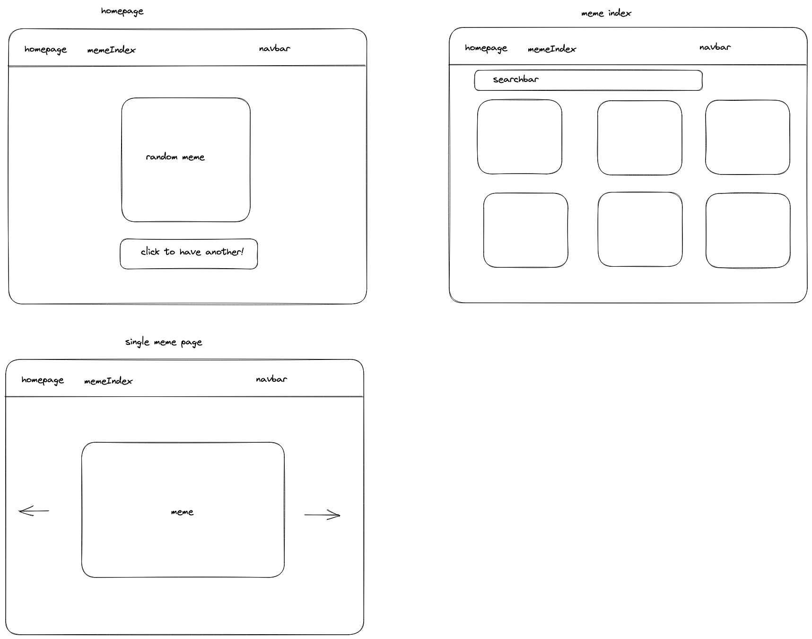

# General Assembly Project 2

## Table of Contents
* [Description](#description)
    - [Deployment Link](#deployment-link)
    - [Code Installation](#code-installation)
    - [Timeframe and Working Team](#timeframe-and-working-team)
    - [Technologies Used](#technologies-used)
    - [Brief](#brief)
* [Planning](#planning)
* [Building the App](#building-the-app)
    - [Homepage](#homepage)
    - [Helping My Peers](#helping-my-peers)
* [Challenges](#challenges)
* [Wins](#wins)
* [Key Takeaways](#key-takeaways)
* [Bugs](#bugs)
* [Future Improvements](#future-improvements)

## Description

Completed in the last two days of our sixth week of the course, and at the end of two weeks looking at React.js, this short project was an opportunity for us to practise what we had learned in building a front end which interacts with an API. The API we chose was a memes API, which we used to create a website that implements some of the features we had been learning to create.

### Deployment Link 

https://samsmemegenerator.netlify.app

### Code Installation

- Make sure you have installed Node.js.
- Download the project onto your local machine.
- Open your terminal and navigate to the root path of the project.
- Run `npm install` then `npm start`.

### Timeframe and Working Team

We were given 48 hours to complete this project. Most teams worked in pairs, but as the class was an odd number our team had three members.

### Technologies Used

The app was built using React.js and styled using Bulma and SASS. The app also uses packages installed using npm, including Axios.

### Brief

Our brief was to create an app that:

- Consumes a public API.
- Has several components, at least one classical and one functional.
- Has a router with several "pages".
- Includes wireframes designed before building the app.
- Is deployed online and accessible to the public.

## Planning

Because the project was so short and this was our first experience of building an app within a team, the planning stage was fairly rudimentary. We created a quick wireframe of what we wanted the app to look like.

<p align='center'>

</p>

We also created a google doc which roughly sketched out a to-do list and how we were going to divide the workload.

<p align='center'>

</p>

## Build Process

In our dividing up of the tasks I had the responsibility of writing out the navbar and the homepage. Both of these tasks were fairly straightforward and did not take much time to complete, as we had practised building similar features previous to starting the project.
For the navbar, I used Bulma as a base for styling, and the Link component from react-router-dom to navigate to the various pages on the site.

```
import { Link } from 'react-router-dom';
    
     function Navbar() {
       return (
         <nav className="navbar is-dark">
         <div className="nav-container">
         <div className="navbar-brand">
               
              <Link to="/" className="navbar-item">
                Meme Generator
              </Link>
              <Link to="/memes" className="navbar-item">
                Meme Index
              </Link>
   
              <Link to="/memes/carousel" className="navbar-item">
                Meme Carousel
              </Link>
              
            </div>
          </div>
        </nav> 
           );
    }
   
    export default Navbar;
```

### Homepage

My second task was to set up a homepage in which users could grab a random meme from the API. This was also a fairly straightforward task, in which I grabbed all images, then used `Math.random()` to set the homepage image as a random image from the API. I embedded this within a `useEffect` hook which would be called whenever the user clicked on the meme.

```
  const [randomMeme, setRandomMeme] = useState(null); 
  const [randomToggle, setRandomToggle] = useState(true);
    
       function handleClick() {
         setRandomToggle(!randomToggle);
       }
    
       useEffect(() => {
         getAllMemes()
           .then((res) =>
            setRandomMeme(res.data.data.memes[Math.round(Math.random() * 100)])
          )
           .catch((err) => console.error(err));
      }, [randomToggle]);
   
      if (randomMeme === null) {
        return <Spinner />;
      }
```

### Helping My Peers
My peers Imogen and Ebrar worked on setting up API calls, and the index page respectively. While my tasks in building the app were fairly straightforward, the other members in my group had some trouble with their tasks, so I also spent a good deal of time helping to troubleshoot these problems.

The most significant of these problems was implementing a carousel into the app. The initial plan was to have the option to click on the memes in the index to enlarge them, and then have the option of clicking through them as they were enlarged. We encountered several problems in implementing this however, as the images did not come in a standard size, some being very large while others were quite small, so coming up with a standard size proved tricky.

We encountered various bugs in which images would not appear, or appeared far too large, far too small, or in places that we didn’t want them to appear. We used an imported carousel function to swipe through the memes but struggled to implement this into the index page, so we scrapped enlarging memes and swiping through them on the index page, and instead created a new page with the carousel function. Throughout this process I advised my peers on what we could do, looking at their code to find where it might be going wrong. Eventually, we found that the code written out for the carousel was meant for a different carousel package, so we found and implemented the correct code.

## Challenges

As we had previously practised creating React apps, most of the structure of the app was fairly straightforward in implementing, but when it came to dealing with the particular quirks of the API that we chose, these being the irregularity of image sizes and the lack of any data other than an image, was where the challenge lay. This being our first time working collaboratively, we also encountered a lot of problems in getting to grips with using branches and collaborating on GitHub. We addressed this challenge by pulling, merging, and pushing our work at the same time, as well as sharing each others’ screens to help each other make sure we went through the steps correctly.

## Wins

For this project, though I do not feel that the code is particularly strong, I do feel quite proud of various things which pertain to the teamwork side of the project.
- This was our first group project working together, and when it came to dividing up the work we did not encounter any problems whatsoever.
- Though it was quite challenging helping others with their bugs, I feel proud of the assistance that I gave to my peers in helping them solve their problems, as well as the fact that I was fairly independent in completing my own tasks.
- I did not personally encounter any problems when working collaboratively with Git/GitHub.
- From the start I assumed somewhat of a leading role, in that though we worked on an equal footing, I hosted the project, wrote out the plans, and contributed the most in terms of helping out other members of the team.

## Key Learnings

- Being our first collaborative project I learned a lot about what it’s like to develop an app as a team. This gave me a lot of confidence going into future team projects.
- Encountering the bugs we came across was very useful in helping me to develop my understanding of implementing React.js components.
- In using a styling library I learned a lot about how to make use of one as a basis for an app, as well as how to build on this basis with a mixture of custom CSS/SASS and style libraries.

## Bugs

On the meme carousel page at certain widths, the images appear slightly off to one side.

## Future Improvements

Were I to work on this project again I would like to implement the carousel on the index page. I would also like to add login functionality and allow account holders to create their own memes.
